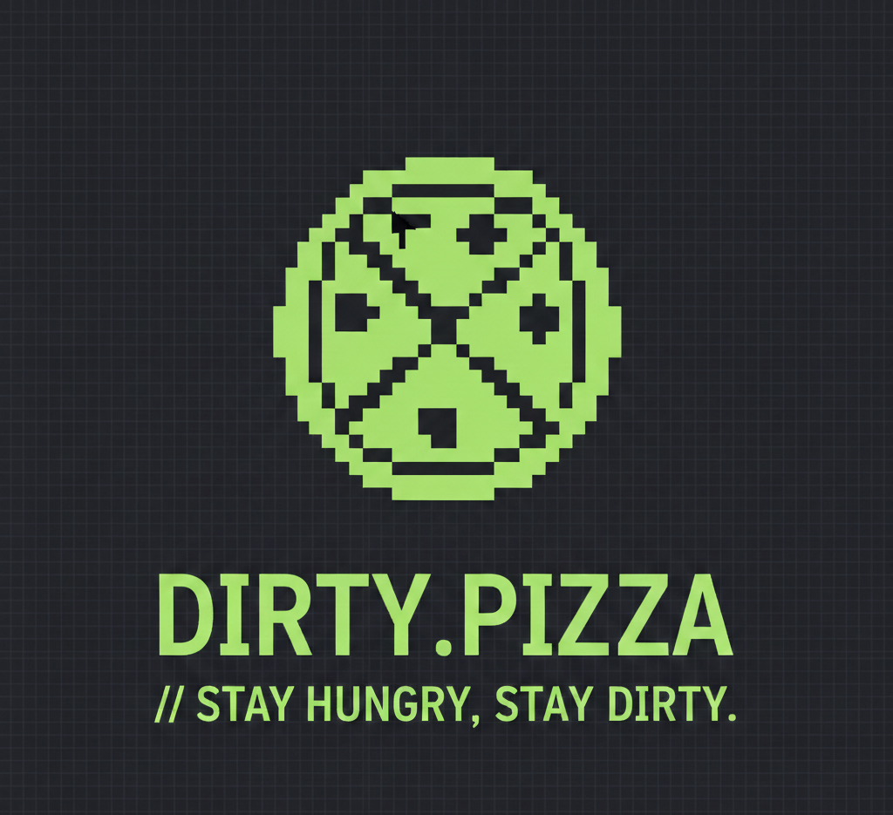

 
    
    
  
      
# 🍕 Dirty Pizza

> **"Stay hungry, stay dirty."**

A minimalist, high-performance landing page built for speed and aesthetic precision. This repository houses the source code for [dirty.pizza](https://dirty.pizza), featuring a bespoke dark-mode interface and responsive architecture.

---

### 🍕 Why "Dirty"?

In a web filled with bloated frameworks and tracking scripts, **Dirty Pizza** is about returning to the essentials. It’s raw, it’s fast, and it’s unpolished in all the right ways. No filler, just the crust and the heat.

---

### ⚡ Tech Stack

* **HTML5 / CSS3:** Custom-crafted layouts with a focus on typography.
* **JavaScript:** Lightweight interactions and smooth transitions.
* **GitHub Pages:** Seamless deployment and hosting.

### 📂 Structure

```text
├── 404.html       # Fun 404 Page
└── index.html     # Main entry point
